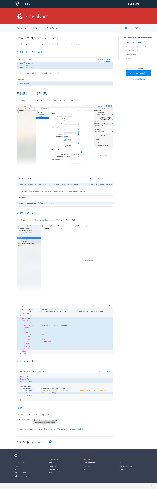
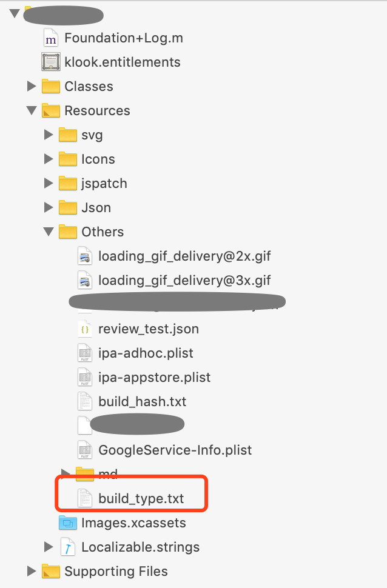
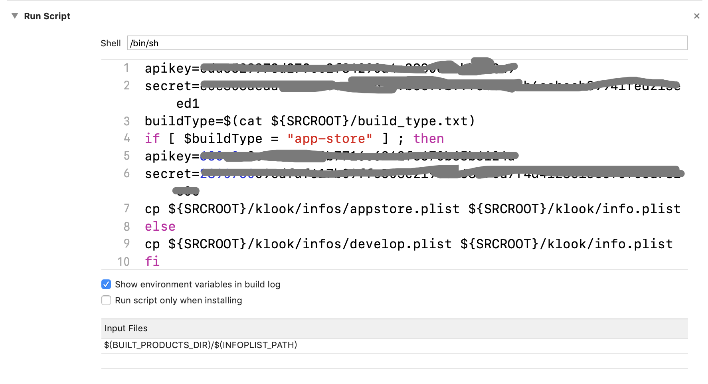
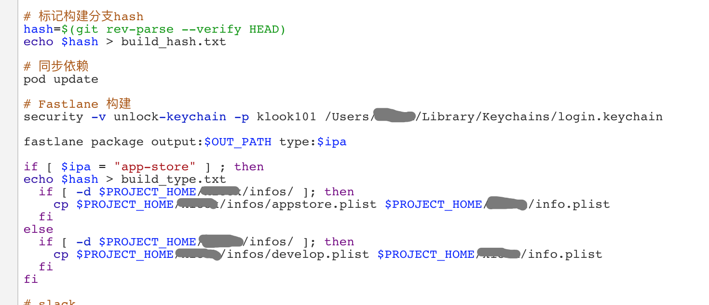

> 背景：  
> APP里面之前添加了 Fabric Crashlytics 统计，现在想区分产线和开发环境的数据统计的数据。
> 这个需求非常像分渠道打包。

## 如何部署 Fabric
先看看如何在 APP 部署 Fabric
[Get Start](https://fabric.io/kits/ios/crashlytics)

* 需要修改 TARGETS => BUILD PHASES => RUN SCRIPT
* 需要修改 Info.plist

## 通过 Jenkins 设置参数
目前项目中大家都通过 Jenkins 打 APP 的包。在 Jenkis 设置打包设置一个参数，来区分需要打的是哪个包，或者哪个渠道。

在项目中新建一个 build_type.txt 文件，作为 flag 文件，文件内容默认为 `develop`。

如果参数变为了 app-store 就会替换成其他的参数。

通过 Jenkins 作为自动化，输入要打包的类别，实际的设置如下：

## 参考
* (iOS 一套代码多APP／多渠道／多target+自动打包脚本)[https://www.jianshu.com/p/73343b4fc42b]
* (iOS使用脚本批量打渠道包)[https://blog.csdn.net/u010124617/article/details/46547523]
* (iOS自动化的打渠道包解决方案)[https://cloud.tencent.com/info/7ad0c70f2ce6873901d7e38a80449ad9.html]